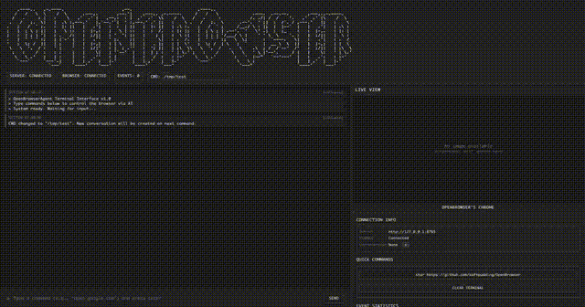
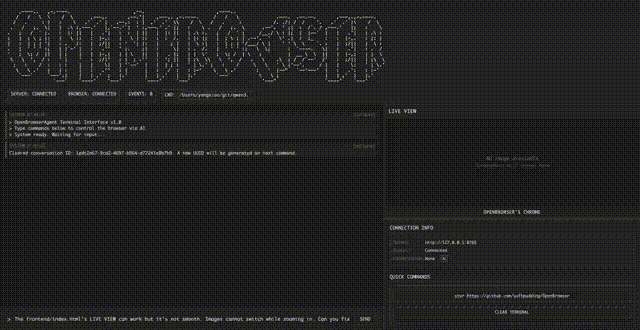

# OpenBrowser

**OpenBrowser** is a visual AI assistant powered by **Qwen3.5-Plus** that bridges the gap between frontend and backend development. By combining coding capabilities with visual browser perception, OpenBrowser enables seamless full-stack debugging and automation.

> **Note**: OpenBrowser currently supports **Chrome only** (via Chrome extension) and has been tested exclusively with **Qwen3.5-Plus**. Other models are not officially supported.
>
> **Limitation**: OpenBrowser currently supports **single-session only**. All operations share a global conversation context; multi-session management is not yet implemented.

## Why Qwen3.5-Plus?

We chose Qwen3.5-Plus as our foundation model because it offers exceptional multimodal capabilities at a fraction of the cost of competitors. Its native agentic design makes it ideal for tasks that require both visual understanding and code execution.

**Key Advantages:**
- **Strong Multimodal Capabilities**: Native multimodal training enables deep understanding of both code and visual content
- **Cost-Effective**: Priced at approximately $0.688-$3.44 per 1M tokens, roughly 1/18 the cost of Gemini 3 Pro
- **Agentic Design**: Specifically optimized for autonomous agent workflows

Learn more about Qwen3.5:

- [Qwen3.5: Towards Native Multimodal Agents (Official Blog)](https://qwen.ai/blog/qwen3.5)
- [Qwen3.5: Towards Native Multimodal Agents (Alibaba Cloud)](https://www.alibabacloud.com/blog/qwen3.5-towards-native-multimodal-agents)
- [Alibaba unveils Qwen3.5 as China's chatbot race shifts to AI agents (CNBC)](https://www.cnbc.com/2026/02/17/china-alibaba-qwen3.5-ai-agent.html)
- [Alibaba unveils new Qwen3.5 model for 'agentic AI era' (Reuters)](https://www.reuters.com/technology/alibaba-unveils-qwen3.5-agentic-ai)
- [QwenLM/Qwen3.5 (GitHub)](https://github.com/QwenLM/Qwen3.5)

## The Vision

Modern development workflows often require switching between:
- Writing code
- Inspecting browser state visually
- Interacting with web UIs
- Running terminal commands

OpenBrowser unifies these tasks into a **single-model closed loop**. Qwen3.5-Plus handles everything—code generation, visual perception, browser control, and bash execution—enabling the AI assistant to truly understand and debug full-stack applications end-to-end.

## Key Differentiators

### 1. Single-Model Closed Loop
Unlike other AI coding assistants that separate code generation from execution verification, OpenBrowser uses **one model (Qwen3.5-Plus) for the entire development cycle**:
- **Code Generation**: Write and modify code
- **Visual Verification**: Observe browser state through screenshots
- **Browser Control**: Interact with web UIs using JavaScript execution and tab operations
- **Terminal Execution**: Run bash commands for backend operations

This closed-loop approach enables true end-to-end debugging and automation without context switching between different tools or models.

### 2. Chrome Extension Architecture
OpenBrowser operates as a **Chrome extension that controls your local browser**, providing unique advantages:
- **Use Your Identity**: The extension inherits your browser's cookies, sessions, and login states, allowing the AI to interact with websites as you
- **Bypass CAPTCHAs**: Since the AI uses your authenticated browser session, most CAPTCHA and verification challenges are avoided
- **Access Restricted Content**: Interact with internal tools, private dashboards, and authenticated services that require your credentials
- **Natural Browsing**: The AI operates within your existing browser environment, maintaining your bookmarks, extensions, and preferences

### 3. Optimized for Qwen3.5-Plus
OpenBrowser is specifically designed for **Qwen3.5-Plus**, leveraging its unique strengths:
- **Native Multimodal Training**: Unlike models with bolted-on vision capabilities, Qwen3.5-Plus was trained from the ground up with multimodal understanding
- **Cost-Effective at Scale**: At ~$0.688-$3.44 per 1M tokens (roughly 1/18 the cost of Gemini 3 Pro), extensive browser automation becomes economically viable
- **Agentic Architecture**: Purpose-built for autonomous agent workflows requiring tool use, visual reasoning, and multi-step planning

## Key Features

- **Single-Model Automation**: One model for coding, visual observation, browser interaction, and terminal commands
- **Visual Browser Control**: Real-time screenshots for verification and understanding page structure
- **JavaScript-Based Automation**: Execute JavaScript for all page interactions (clicking, typing, scrolling, data extraction)
- **Tab Management**: Open, close, switch, and manage browser tabs with session isolation
- **Terminal Integration**: Execute bash commands for backend operations
- **Multiple Interfaces**: REST API and WebSocket

## Demos

### Demo 1: Building and Testing an HTML Calculator

A typical use case showing OpenBrowser developing an HTML calculator and visually verifying it in the browser.



[📺 Watch full video: calculator-demo-2x.mp4](demo/calculator-demo-2x.mp4)

### Demo 2: OpenBrowser Debugging Itself

Real-world use case: OpenBrowser debugging its own frontend issues.



[📺 Watch full video: openbrowser-debug-openbrowser-1.5x.mp4](demo/openbrowser-debug-openbrowser-1.5x.mp4)

## Quick Start

### 1. Install Python Dependencies

```bash
# Using uv (recommended)
uv sync

# Or using pip
pip install -e .
```

### 2. Start the Server

```bash
local-chrome-server serve
```

The server will start at `http://127.0.0.1:8765` (HTTP) and `ws://127.0.0.1:8766` (WebSocket).

### 3. Configure LLM Settings

On first access, you'll be prompted to configure your LLM settings through the web interface:

1. Open `http://localhost:8765` in your browser
2. You'll see the **Configuration Page**
3. Fill in your API details:
   - **Model**: Default is `dashscope/qwen3.5-plus`
   - **Base URL**: Default is `https://dashscope.aliyuncs.com/compatible-mode/v1`
   - **API Key**: Your API key (required)
4. Optionally configure the **Default Working Directory** (CWD)
5. Click **Save** and then **Continue to Main Interface**

> **Note**: 
> - Configuration is stored in `~/.openbrowser/llm_config.json`
> - You can modify settings anytime by clicking the **⚙️ Settings** button in the status bar
> - Environment variables (LLM_API_KEY, LLM_MODEL, LLM_BASE_URL) are **no longer supported** - please use the web UI configuration

### 4. Build the Chrome Extension

```bash
cd extension
npm install
npm run build
```

### 5. Install the Extension in Chrome

1. Open Chrome and navigate to `chrome://extensions/`
2. Enable **Developer mode** (toggle in top-right)
3. Click **Load unpacked**
4. Select the `extension/dist` directory

### 6. Access the Web Frontend

Open your browser and visit:

```
http://localhost:8765
```

You can now interact with the AI Agent through the web interface.

## Architecture

```
┌─────────────────────────────────────────────────────────────┐
│                    Qwen3.5-Plus (Multimodal LLM)            │
│         Code │ Visual │ Tool Orchestration │ Bash          │
└─────────────────────────────────────────────────────────────┘
                              │
                              ▼
┌─────────────────────────────────────────────────────────────┐
│              OpenBrowser Agent Server (FastAPI)             │
└─────────────────────────────────────────────────────────────┘
                              │
                              ▼
┌─────────────────────────────────────────────────────────────┐
│              Chrome Extension (Chrome DevTools)             │
│         Screenshots │ JavaScript Execution │ Tab Management │
└─────────────────────────────────────────────────────────────┘
```

## Development

### Build Commands

```bash
# Extension development build with watch
cd extension
npm run dev

# TypeScript type checking
npm run typecheck

# Run tests
pytest
```

### Project Structure

```
.
├── server/              # FastAPI server and agent logic
│   ├── agent/          # Agent orchestration
│   ├── api/            # REST endpoints
│   ├── core/           # Core processing logic
│   └── websocket/      # WebSocket server
├── extension/          # Chrome extension (TypeScript)
│   ├── src/
│   │   ├── background/ # Background script with CDP
│   │   ├── commands/   # Browser automation commands
│   │   └── content/    # Content script for visual feedback
│   └── dist/           # Built extension
└── frontend/           # Web UI
```

## License

MIT

## Acknowledgments

This project is built upon the [OpenHands SDK](https://github.com/OpenHands/software-agent-sdk), which provides the foundation for our agent architecture and tool integration. We gratefully acknowledge the OpenHands team's contributions to the open-source community.

Special thanks to:
- **OpenHands Team** - For the excellent SDK that powers our agent system
- **Qwen Team (Alibaba)** - For the powerful Qwen3.5-Plus multimodal model