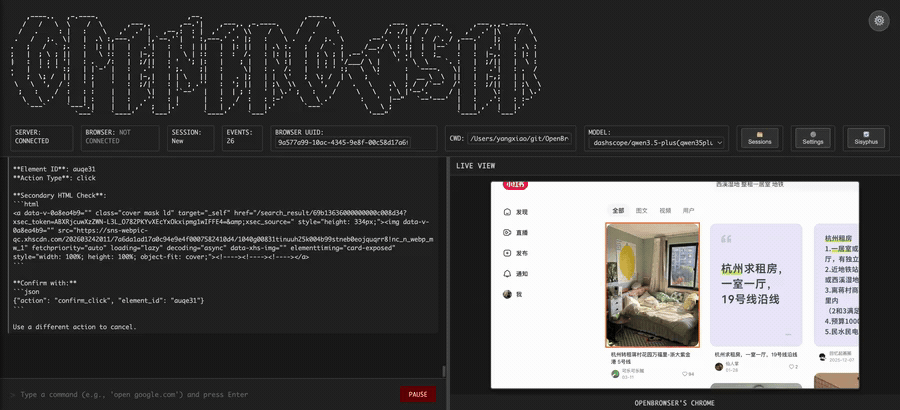

# OpenBrowser

OpenBrowser is a multimodal browser agent for real web tasks.

It treats browser automation as a visual and interactive systems problem, not just a DOM parsing problem. Browsers are among the most complex pieces of software most people use every day. Reading the DOM can help, but understanding the DOM is not the same thing as actually operating the page. The long-term direction we believe in is multimodal control, or at least a strongly hybrid approach.

OpenBrowser is built around that view:

- Operate pages visually through screenshots and direct browser actions
- Keep browser execution isolated from the control window
- Evaluate continuously on mocked sites and real workflows
- Treat model cost as a first-class engineering constraint

> Note: OpenBrowser currently supports Chrome only through a Chrome extension. Development and evaluation are mainly done with `dashscope/qwen3.5-plus` and `dashscope/qwen3.5-flash`.

## Demo

### Apartment Hunting on Xiaohongshu

This demo is a better representation of what OpenBrowser is trying to do than a benchmark replay. The agent searches Xiaohongshu for apartments near Xixi Wetland, inspects multiple posts, judges renovation quality from images, likes and saves strong candidates, leaves comments, and then produces a shortlist.

Task prompt:

> Help me find 3 whole one-bedroom rentals near Xixi Wetland on Xiaohongshu. They should be close to a metro station, not feel too old, dark, cluttered, or overly styled, and the kitchen, bathroom, and bedroom should look clean with decent natural light. Browse multiple posts, pick the best 3, like and save them, comment on the best 2 to ask about price, earliest move-in date, short-term rental, and whether cats are allowed, then summarize why you chose them.



[Watch full video: xiaohongshu_3_apartments_3x.mp4](demo/xiaohongshu_3_apartments_3x.mp4)

What this demo shows:

- Visual judgment, not just text extraction: lighting, clutter, decoration quality, and room condition
- Real browser-side interaction: search, open posts, like, save, and comment
- Multi-step decision making across multiple candidates
- End-to-end output instead of isolated single-page actions

### News Collection from WSJ, CNN, and Reuters

OpenBrowser browses major news sites, collects relevant articles, and writes a translated summary of a developing event.


[Watch full video: news_collection.mp4](demo/news_collection.mp4)

#### Collected Articles

OpenBrowser collected the following articles and saved them as markdown files:

- **[伊朗战争新闻汇总_2026-03-08.md](demo/伊朗战争新闻汇总_2026-03-08.md)** - Summary of all collected news with translations
- **[WSJ_伊朗历史首都成为美以空战震中.md](demo/WSJ_伊朗历史首都成为美以空战震中.md)** - WSJ report on Isfahan air strikes
- **[WSJ_特朗普不排除向伊朗派遣地面部队_实时更新.md](demo/WSJ_特朗普不排除向伊朗派遣地面部队_实时更新.md)** - WSJ live updates on Trump's Iran policy
- **[CNN_伊朗战争实时更新_能源设施袭击.md](demo/CNN_伊朗战争实时更新_能源设施袭击.md)** - CNN live coverage of energy facility attacks

## Why OpenBrowser

### Browsers are hard

The browser is already one of the most complicated software environments in industry: dynamic layouts, asynchronous state, popups, tab switches, scrolling containers, partial rendering, and noisy visual context all show up in routine tasks.

### The most native interface is visual

Humans operate browsers by looking at the page and using the mouse and keyboard. Current models still need engineering help to do that reliably, but the native control loop is still visual. That is why OpenBrowser treats screenshots and interaction primitives as central.

### DOM helps, but DOM-only is not the end state

DOM-heavy systems such as PinchTab or OpenClaw Browser Relay can work well today, and in some tasks they may be faster or more accurate than a multimodal pipeline. But DOM understanding is not the same as being able to operate a page robustly. Our view is that the best long-term browser agent will be multimodal, or at least strongly hybrid.

### Evaluation is part of development

OpenBrowser is not iterated by vibe alone. The repo includes mocked websites with event tracking under [`eval/`](eval/), and meaningful changes are checked against that evaluation suite. Failed real-world behaviors become new evaluation cases.

### Cost matters

Model capability matters, but so does price. We do not assume token costs stay cheap forever. OpenBrowser is developed with that constraint in mind, including separate handling for stronger and cheaper models.

## Evaluation

OpenBrowser is evaluated in two complementary ways:

- Real browser workflows and side-by-side comparisons against existing approaches
- A custom regression suite of mocked websites with event tracking in [`eval/`](eval/)

The main archived comparison in this repo keeps the same control setup and compares `OpenClaw Browser Relay` with `OpenClaw + OpenBrowser skill`:

- [`eval/archived/2026-03-16/browser_agent_evaluation_2026-03-16_openclaw_vs_openbrowser.md`](eval/archived/2026-03-16/browser_agent_evaluation_2026-03-16_openclaw_vs_openbrowser.md)
- [`eval/evaluation_report.json`](eval/evaluation_report.json)

What we track:

- Pass rate
- Execution time
- Cost
- Remaining context headroom in the control window

Representative archived results from `2026-03-16`:

| Setup | Pass Rate | Avg. Time | Control Window Context |
|--------|-----------|-----------|------------------------|
| OpenClaw Browser Relay | 6/7 | 211s | 640% |
| OpenClaw + OpenBrowser (`qwen3.5-plus`) | 7/7 | 274s | 21% |
| OpenClaw + OpenBrowser (`qwen3.5-flash`) | 5/7 first pass, 7/7 with retry | 317s | 12% |

That comparison is not meant to claim OpenBrowser wins every metric on every task. It is meant to make the tradeoff explicit: DOM-heavy relay systems can be strong today, while OpenBrowser is designed to preserve control-window headroom, support a multimodal execution path, and improve through repeatable evaluation.

### Run Your Own Evaluation

```bash
# List available tests
python eval/evaluate_browser_agent.py --list

# Set the browser capability token once
export OPENBROWSER_CHROME_UUID=YOUR_BROWSER_UUID

# Run all tests with both models
python eval/evaluate_browser_agent.py --model dashscope/qwen3.5-plus --model dashscope/qwen3.5-flash

# Or pass the browser UUID explicitly per run
python eval/evaluate_browser_agent.py --test techforum --chrome-uuid YOUR_BROWSER_UUID
```

See [AGENTS.md](AGENTS.md#evaluation-system) for evaluation framework documentation.

## Quick Start

### Try OpenBrowser with your browser

#### 1. Install Python Dependencies

```bash
# Using uv (recommended)
uv sync

# Or using pip
pip install -e .

# For development (includes dev dependencies like pytest, black, ruff)
uv sync --group dev
# Or with pip
pip install -e ".[dev]"
```

#### 2. Start the Server

```bash
uv run local-chrome-server serve
```

The server will start at `http://127.0.0.1:8765` (HTTP) and `ws://127.0.0.1:8766` (WebSocket).

#### 3. Configure LLM Settings

On first access, you'll be prompted to configure your LLM settings through the web interface:

1. Open `http://localhost:8765` in your browser
2. You'll see the **Configuration Page**
3. Fill in your API details:
   - **Model**: Default is `dashscope/qwen3.5-plus` (also supports `dashscope/qwen3.5-flash` as a cost-effective alternative)
   - **Base URL**: Default is `https://dashscope.aliyuncs.com/compatible-mode/v1`
   - **API Key**: Your API key (required)
4. Optionally configure the **Default Working Directory** (CWD)
5. Click **Save** and then **Continue to Main Interface**

> **Note**: 
> - Configuration is stored in `~/.openbrowser/llm_config.json`
> - You can modify settings anytime by clicking the **⚙️ Settings** button in the status bar
> - Environment variables (LLM_API_KEY, LLM_MODEL, LLM_BASE_URL) are **no longer supported** - please use the web UI configuration

#### 4. Build the Chrome Extension

```bash
cd extension
npm install
npm run build
```

#### 5. Install the Extension in Chrome

1. Open Chrome and navigate to `chrome://extensions/`
2. Enable **Developer mode** (toggle in top-right)
3. Click **Load unpacked**
4. Select the `extension/dist` directory

After installation, OpenBrowser will open a browser-internal page that shows this browser's UUID.
This UUID is the permission key for controlling that specific browser instance.

Important:
- Anyone who has this UUID can operate that browser through OpenBrowser
- Do not share it casually
- Clicking the extension icon will reopen the UUID page later

#### 6. Configure Chrome Pop-up Settings (IMPORTANT)

By default, Chrome blocks pop-up windows, which can prevent OpenBrowser from opening new tabs when clicking links. You need to configure Chrome to allow pop-ups:

**Option A: Allow pop-ups for specific sites (Recommended)**

1. When a pop-up is blocked, you'll see a blocked pop-up icon (🚫) in the address bar
2. Click the icon and select "Always allow pop-ups and redirects from [site]"
3. Click **Done**

**Option B: Allow pop-ups globally**

1. Open Chrome Settings: `chrome://settings/content/popups`
2. Under "Default behavior", select **Sites can send pop-ups and use redirects**
3. Alternatively, add specific sites to the "Allowed to send pop-ups" section

> **Note**: If OpenBrowser clicks a link but no new tab opens, check the address bar for the blocked pop-up icon. This is a common issue for new users.

#### 7. Access the Web Frontend

Open your browser and visit:

```
http://localhost:8765
```

You can now interact with the AI Agent through the web interface.

Before sending commands:
1. Copy the browser UUID from the extension page
2. Paste it into the `BROWSER UUID` field in the frontend
3. Start chatting

The permission flow is:

1. The Chrome extension connects to the server through WebSocket
2. The server stores a `uuid -> websocket` mapping for that browser
3. The frontend session asks the user for the UUID
4. When the user sends a message, the frontend includes that UUID
5. The server uses the UUID to route browser commands to the correct extension connection

This means browser control is authorized by possession of the UUID capability token.

---

### Try OpenBrowser with SKILL - install to your local agents

Simply tell your agent to install `skill/codex/open-browser`

## Why Qwen3.5 Family Right Now?

OpenBrowser is developed mainly against the Qwen3.5 family because it gives a useful working point on the capability-versus-cost curve for multimodal browser tasks.

In practice:

- `qwen3.5-plus` is used for harder visual reasoning and more demanding multi-step execution
- `qwen3.5-flash` is useful when iteration speed and cost matter more than peak capability
- the project treats model choice as an engineering tradeoff, not as the product itself

Learn more about Qwen3.5:

- [Qwen3.5: Towards Native Multimodal Agents (Official Blog)](https://qwen.ai/blog/qwen3.5)
- [Qwen3.5: Towards Native Multimodal Agents (Alibaba Cloud)](https://www.alibabacloud.com/blog/qwen3.5-towards-native-multimodal-agents)
- [Alibaba unveils Qwen3.5 as China's chatbot race shifts to AI agents (CNBC)](https://www.cnbc.com/2026/02/17/china-alibaba-qwen3.5-ai-agent.html)
- [Alibaba unveils new Qwen3.5 model for 'agentic AI era' (Reuters)](https://www.reuters.com/technology/alibaba-unveils-qwen3.5-agentic-ai)
- [QwenLM/Qwen3.5 (GitHub)](https://github.com/QwenLM/Qwen3.5)

## Design Principles

### 1. Multimodal first, hybrid when useful

OpenBrowser is built around visual page understanding and direct interaction. Structured signals such as DOM can still be useful, but they are not assumed to be the whole answer.

### 2. Keep execution isolated

The browser worker should not dump all state into the control window. OpenBrowser uses an independent execution path so the control model does not carry the entire browser session history.

### 3. Evaluate continuously

The repo contains mocked websites, event tracking, and archived comparison runs. The goal is not just to demo well once, but to improve under regression pressure.

### 4. Respect cost constraints

Browser agents are only useful if they remain practical to run. OpenBrowser therefore treats pricing and context usage as core design constraints, not afterthoughts.

## Key Features

- **Visual AI Automation**: See and interact with web pages using AI-powered visual recognition
- **Browser Control**: Click, type, scroll, and navigate through visual understanding and JavaScript execution
- **Tab Management**: Open, close, switch, and manage browser tabs with session isolation
- **Data Extraction**: Scrape and collect data from websites with AI understanding of page structure
- **Form Filling & Submission**: Automatically fill forms, submit data, and handle multi-step workflows
- **Session Persistence**: Maintain browser sessions, cookies, and login states across automation tasks
- **Multi-Interface Access**: REST API, WebSocket, and CLI for programmatic control

## Architecture

```
┌─────────────────────────────────────────────────────────────┐
│              Qwen3.5 Family (Multimodal LLM)                │
│        Qwen3.5-Plus (primary) / Qwen3.5-Flash (cost-effective)
│         Visual Perception │ Decision Making │ Browser Control │
└─────────────────────────────────────────────────────────────┘
                              │
                              ▼
┌─────────────────────────────────────────────────────────────┐
│              OpenBrowser Agent Server (FastAPI)             │
│         REST API │ WebSocket │ Session Management │ Tool Orchestration
└─────────────────────────────────────────────────────────────┘
                              │
                              ▼
┌─────────────────────────────────────────────────────────────┐
│              Chrome Extension (Chrome DevTools)             │
│         Screenshots │ JavaScript Execution │ Tab Management │
└─────────────────────────────────────────────────────────────┘
```

## Development

### Build Commands

```bash
# Extension development build with watch
cd extension
npm run dev

# TypeScript type checking
npm run typecheck
```

### Project Structure

```
.
├── server/              # FastAPI server and agent logic
│   ├── agent/          # Agent orchestration
│   ├── api/            # REST endpoints
│   ├── core/           # Core processing logic
│   └── websocket/      # WebSocket server
├── extension/          # Chrome extension (TypeScript)
│   ├── src/
│   │   ├── background/ # Background script with CDP
│   │   ├── commands/   # Browser automation commands
│   │   └── content/    # Content script for visual feedback
│   └── dist/           # Built extension
└── frontend/           # Web UI
```

## License

LGPL-3.0

## Acknowledgments

This project is built upon the [OpenHands SDK](https://github.com/OpenHands/software-agent-sdk), which provides the foundation for our agent architecture and tool integration. We gratefully acknowledge the OpenHands team's contributions to the open-source community.

Special thanks to:
- **OpenHands Team** - For the excellent SDK that powers our agent system
- **Qwen Team (Alibaba)** - For the powerful Qwen3.5-Plus multimodal model
