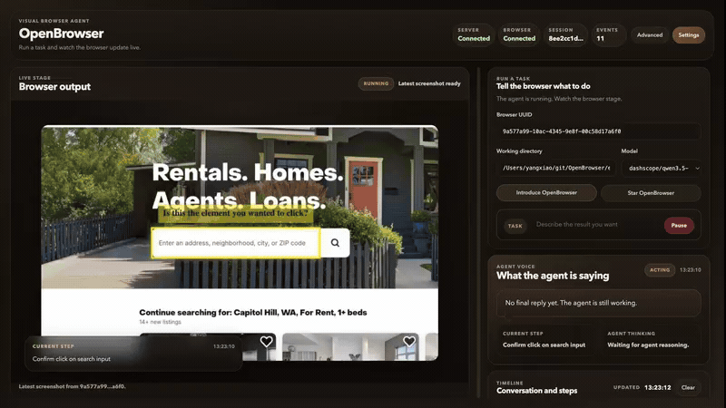

# OpenBrowser

[](https://deepwiki.com/softpudding/OpenBrowser)

[中文 README](README.zh-CN.md)

OpenBrowser is a multimodal browser agent for real web tasks.

It treats browser automation as a visual and interactive systems problem, not just a DOM parsing problem. Browsers are among the most complex pieces of software most people use every day. Reading the DOM can help, but understanding the DOM is not the same thing as actually operating the page. The long-term direction we believe in is multimodal control, or at least a strongly hybrid approach.

OpenBrowser is built around that view:

- Operate pages visually through screenshots and direct browser actions
- Turn manual browser demonstrations into reusable routines through record -> compile -> replay
- Keep browser execution isolated from the control window
- Evaluate continuously on mocked sites and real workflows
- Treat model cost as a first-class engineering constraint

> Note: OpenBrowser currently supports Chrome only through a Chrome extension. Development and evaluation are mainly done with `dashscope/qwen3.5-plus` and `dashscope/qwen3.5-flash`.

## Demo

### Apartment Hunting on Zillow

This demo is a better representation of what OpenBrowser is trying to do than a benchmark replay. The agent searches Zillow for one-bedroom rentals in Capitol Hill, Seattle, opens and compares multiple listings, judges brightness, cleanliness, practicality, and value from the listing photos, and then produces a shortlist.

Task prompt:

> Find the best 3 one-bedroom apartment rentals in Capitol Hill, Seattle on Zillow.
>
> Prioritize places that look bright, clean, practical, and close to everyday city life.
> Avoid units that look dark, cramped, outdated, cluttered, or overpriced for what they offer.
>
> Browse multiple listings (view at least 10, for better candidates), compare them visually, and return the best 3 choices with:
> 1. a one-sentence reason,
> 2. the rent,
> 3. the listing link.



[Watch full video: recording_zillow.webm](demo/recording_zillow.webm)

What this demo shows:

- Visual judgment, not just text extraction: lighting, cleanliness, layout practicality, and overall value
- Real browser-side interaction: search, open listings, compare candidates, and inspect details
- Multi-step decision making across a larger candidate set
- End-to-end output with reasons, rents, and listing links

## Why OpenBrowser

### Browsers are hard

The browser is already one of the most complicated software environments in industry: dynamic layouts, asynchronous state, popups, tab switches, scrolling containers, partial rendering, and noisy visual context all show up in routine tasks.

### The most native interface is visual

Humans operate browsers by looking at the page and using the mouse and keyboard. Current models still need engineering help to do that reliably, but the native control loop is still visual. That is why OpenBrowser treats screenshots and interaction primitives as central.

### DOM helps, but DOM-only is not the end state

DOM-heavy systems such as PinchTab or OpenClaw Browser Relay can work well today, and in some tasks they may be faster or more accurate than a multimodal pipeline. But DOM understanding is not the same as being able to operate a page robustly. Our view is that the best long-term browser agent will be multimodal, or at least strongly hybrid.

### Evaluation is part of development

OpenBrowser is not iterated by vibe alone. The repo includes mocked websites with event tracking under [`eval/`](eval/), and meaningful changes are checked against that evaluation suite. Failed real-world behaviors become new evaluation cases.

### Cost matters

Model capability matters, but so does price. We do not assume token costs stay cheap forever. OpenBrowser is developed with that constraint in mind, including separate handling for stronger and cheaper models.

## Record, Compile, Replay

OpenBrowser is not only a free-form browser agent. It can also turn a human demonstration into a reusable Browser Routine.

1. Record. The frontend calls `/recordings` to start the extension recorder. The recorder scopes itself to a dedicated recording window by default, captures browser events, and attaches selective keyframes for meaningful actions.
2. Review. After stopping, the UI shows the trace, folded supporting events, and captured keyframes. You can also save a short intent note that explains what the workflow was trying to accomplish.
3. Compile. `/recordings/{id}/compile` runs a Compiler Agent over the raw trace, normalized high-level steps, and keyframes. If the trace is ambiguous, it asks clarification questions before producing validated Routine markdown.
4. Replay. Finalizing the compile stores a named Browser Routine under `/routines`. Running that routine starts a fresh conversation in `routine_replay` mode and executes the high-level Routine, not the raw event stream.

Important design rule: replay is not literal event playback. The recording trace is evidence used to compile and debug the workflow; the saved Routine is the executable artifact.

## Evaluation

The primary evaluation signal in this repo is the latest checked-in report:

- [`eval/evaluation_report.json`](eval/evaluation_report.json)

The test set is a series of local mock websites in [`eval/`](eval/) that simulate realistic browser tasks and record structured interaction events.

That snapshot was generated on `2026-03-30 11:17:06` and evaluates OpenBrowser on `12` tracked browser tasks across two models. We care about three things first:

- Correctness: pass/fail plus task-score coverage
- Efficiency: average execution time
- Cost: average RMB cost per task

Current snapshot:

- Overall: `24/24` runs passed, `100%` pass rate
- `dashscope/qwen3.5-flash`: `12/12` passed, `68.5/68.5` task score, `114.89s` average duration, `0.075442 RMB` average cost
- `dashscope/qwen3.5-plus`: `12/12` passed, `67.5/68.5` task score, `149.63s` average duration, `0.291952 RMB` average cost

| Model | Correctness | Avg. Time | Avg. Cost (RMB) | Composite Score |
|-------|-------------|-----------|------------------|-----------------|
| `dashscope/qwen3.5-flash` | `12/12` passed, `68.5/68.5` | `114.89s` | `0.075442` | `0.9358` |
| `dashscope/qwen3.5-plus` | `12/12` passed, `67.5/68.5` | `149.63s` | `0.291952` | `0.8774` |

On the current suite, `qwen3.5-flash` is the better efficiency-cost point: it keeps the same `100%` pass rate, while being about `23.2%` faster and `74.2%` cheaper than `qwen3.5-plus`. `qwen3.5-plus` still remains useful as a stronger fallback profile for harder visual workflows, but the repo's current default evaluation story is no longer "benchmark comparison against OpenClaw"; it is "how well our latest stack scores on correctness, speed, and cost."

Older side-by-side comparisons with OpenClaw are kept only as archived context:

- [`eval/archived/2026-03-16/browser_agent_evaluation_2026-03-16_openclaw_vs_openbrowser.md`](eval/archived/2026-03-16/browser_agent_evaluation_2026-03-16_openclaw_vs_openbrowser.md)

Those archived results are still useful for historical tradeoff discussion, but they are not the main metric we optimize against now.

For the record/replay pipeline, the repo also includes a dedicated routine evaluation harness under [`eval/routine_eval/`](eval/routine_eval/README.md):

- Compile track: does a recording become the right Routine, with good clarification behavior?
- Replay track: does a saved Routine execute end-to-end in `routine_replay` mode?

### Run Your Own Evaluation

```bash
# List available tests
python eval/evaluate_browser_agent.py --list

# Set the browser capability token once
export OPENBROWSER_CHROME_UUID=YOUR_BROWSER_UUID

# Run one test with a configured LLM alias
python eval/evaluate_browser_agent.py --test techforum --model-alias default

# Run all tests with multiple configured aliases
python eval/evaluate_browser_agent.py --model-alias plus --model-alias flash

# Or pass the browser UUID explicitly per run
python eval/evaluate_browser_agent.py --test techforum --chrome-uuid YOUR_BROWSER_UUID --model-alias default
```

`--model-alias` must match an LLM alias configured in the OpenBrowser web UI, such as `default`, `plus`, or `flash`.

See [AGENTS.md](AGENTS.md#evaluation-system) for evaluation framework documentation.

## Quick Start

### Try OpenBrowser with your browser

#### 1. Install Python Dependencies

```bash
# Using uv (recommended)
uv sync

# Or using pip
pip install -e .

# For development (includes dev dependencies like pytest, black, ruff)
uv sync --group dev
# Or with pip
pip install -e ".[dev]"
```

#### 2. Start the Server

```bash
uv run local-chrome-server serve
```

The server will start at `http://127.0.0.1:8765` (HTTP) and `ws://127.0.0.1:8766` (WebSocket).

#### 3. Configure LLM Settings

On first access, you'll be prompted to configure your LLM settings through the web interface:

1. Open `http://localhost:8765` in your browser
2. You'll see the **Configuration Page**
3. Fill in your API details:
   - **Model**: Default is `dashscope/qwen3.5-plus` (also supports `dashscope/qwen3.5-flash` as a cost-effective alternative)
   - **Base URL**: Default is `https://dashscope.aliyuncs.com/compatible-mode/v1`
   - **API Key**: Your API key (required)
4. Optionally configure the **Default Working Directory** (CWD)
5. Click **Save** and then **Continue to Main Interface**

> **Note**: 
> - Configuration is stored in `~/.openbrowser/llm_config.json`
> - You can modify settings anytime by clicking the **⚙️ Settings** button in the status bar
> - Environment variables (LLM_API_KEY, LLM_MODEL, LLM_BASE_URL) are **no longer supported** - please use the web UI configuration

#### 4. Build the Chrome Extension

```bash
cd extension
npm install
npm run build
```

#### 5. Install the Extension in Chrome

1. Open Chrome and navigate to `chrome://extensions/`
2. Enable **Developer mode** (toggle in top-right)
3. Click **Load unpacked**
4. Select the `extension/dist` directory

After installation, OpenBrowser will open a browser-internal page that shows this browser's UUID.
This UUID is the permission key for controlling that specific browser instance.

Important:
- Anyone who has this UUID can operate that browser through OpenBrowser
- Do not share it casually
- Clicking the extension icon will reopen the UUID page later

#### 6. Configure Chrome Pop-up Settings (IMPORTANT)

By default, Chrome blocks pop-up windows, which can prevent OpenBrowser from opening new tabs when clicking links. You need to configure Chrome to allow pop-ups:

**Option A: Allow pop-ups for specific sites (Recommended)**

1. When a pop-up is blocked, you'll see a blocked pop-up icon (🚫) in the address bar
2. Click the icon and select "Always allow pop-ups and redirects from [site]"
3. Click **Done**

**Option B: Allow pop-ups globally**

1. Open Chrome Settings: `chrome://settings/content/popups`
2. Under "Default behavior", select **Sites can send pop-ups and use redirects**
3. Alternatively, add specific sites to the "Allowed to send pop-ups" section

> **Note**: If OpenBrowser clicks a link but no new tab opens, check the address bar for the blocked pop-up icon. This is a common issue for new users.

#### 7. Access the Web Frontend

Open your browser and visit:

```
http://localhost:8765
```

You can now interact with the AI Agent through the web interface.

Before sending commands:
1. Copy the browser UUID from the extension page
2. Paste it into the `BROWSER UUID` field in the frontend
3. Start chatting

The permission flow is:

1. The Chrome extension connects to the server through WebSocket
2. The server stores a `uuid -> websocket` mapping for that browser
3. The frontend session asks the user for the UUID
4. When the user sends a message, the frontend includes that UUID
5. The server uses the UUID to route browser commands to the correct extension connection

This means browser control is authorized by possession of the UUID capability token.

#### 8. Record and Replay a Workflow

Once the frontend and extension are connected:

1. Click `Record` -> `Start recording`
2. Perform the workflow manually in the recording browser window, then stop the recording
3. Review the captured trace and keyframes, and add an intent note if the goal needs extra context
4. Click `Compile Routine`, answer any clarification questions, and finalize the result with a name
5. Run the saved routine from the routine launcher or by typing `/` in the command box to insert it

Routine runs always start a fresh conversation in `routine_replay` mode so replay stays separate from free-form chat sessions.

---

### Try OpenBrowser with SKILL - install to your local agents

OpenBrowser ships with skills for both `Codex` and `OpenClaw`:

- `skill/codex/open-browser`
- `skill/openclaw/open-browser`

They are similar in purpose, but slightly different in workflow:

- The `Codex` skill is tuned for Codex-style repo workflows and supports either foreground or background task execution.
- The `OpenClaw` skill is tuned for OpenClaw usage, emphasizes background execution, and frames OpenBrowser as the stronger option for rendered-page and multi-step browser tasks.

Install the one that matches your local agent environment.

## Why Qwen3.5 Family Right Now?

OpenBrowser is developed mainly against the Qwen3.5 family because it gives a useful working point on the capability-versus-cost curve for multimodal browser tasks.

In practice:

- `qwen3.5-plus` is used for harder visual reasoning and more demanding multi-step execution
- `qwen3.5-flash` is useful when iteration speed and cost matter more than peak capability
- the project treats model choice as an engineering tradeoff, not as the product itself

Learn more about Qwen3.5:

- [Qwen3.5: Towards Native Multimodal Agents (Official Blog)](https://qwen.ai/blog/qwen3.5)
- [Qwen3.5: Towards Native Multimodal Agents (Alibaba Cloud)](https://www.alibabacloud.com/blog/qwen3.5-towards-native-multimodal-agents)
- [Alibaba unveils Qwen3.5 as China's chatbot race shifts to AI agents (CNBC)](https://www.cnbc.com/2026/02/17/china-alibaba-qwen3.5-ai-agent.html)
- [Alibaba unveils new Qwen3.5 model for 'agentic AI era' (Reuters)](https://www.reuters.com/technology/alibaba-unveils-qwen3.5-agentic-ai)
- [QwenLM/Qwen3.5 (GitHub)](https://github.com/QwenLM/Qwen3.5)

## Design Principles

### 1. Multimodal first, hybrid when useful

OpenBrowser is built around visual page understanding and direct interaction. Structured signals such as DOM can still be useful, but they are not assumed to be the whole answer.

### 2. Keep execution isolated

The browser worker should not dump all state into the control window. OpenBrowser uses an independent execution path so the control model does not carry the entire browser session history.

### 3. Evaluate continuously

The repo contains mocked websites, event tracking, and archived comparison runs. The goal is not just to demo well once, but to improve under regression pressure.

### 4. Respect cost constraints

Browser agents are only useful if they remain practical to run. OpenBrowser therefore treats pricing and context usage as core design constraints, not afterthoughts.

## Key Features

- **Visual AI Automation**: See and interact with web pages using AI-powered visual recognition
- **Browser Control**: Click, type, scroll, and navigate through visual understanding and JavaScript execution
- **Record -> Compile -> Replay**: Capture a manual browser workflow, compile it into validated Routine markdown, and rerun it as a reusable task
- **Tab Management**: Open, close, switch, and manage browser tabs with session isolation
- **Data Extraction**: Scrape and collect data from websites with AI understanding of page structure
- **Form Filling & Submission**: Automatically fill forms, submit data, and handle multi-step workflows
- **Session Persistence**: Maintain browser sessions, cookies, and login states across automation tasks
- **Multi-Interface Access**: REST API, WebSocket, and CLI for programmatic control

## Architecture

```
┌─────────────────────────────────────────────────────────────┐
│              Qwen3.5 Family (Multimodal LLM)                │
│        Qwen3.5-Plus (primary) / Qwen3.5-Flash (cost-effective)
│         Visual Perception │ Decision Making │ Browser Control │
└─────────────────────────────────────────────────────────────┘
                              │
                              ▼
┌─────────────────────────────────────────────────────────────┐
│              OpenBrowser Agent Server (FastAPI)             │
│         REST API │ WebSocket │ Session Management │ Tool Orchestration
└─────────────────────────────────────────────────────────────┘
                              │
                              ▼
┌─────────────────────────────────────────────────────────────┐
│              Chrome Extension (Chrome DevTools)             │
│         Screenshots │ JavaScript Execution │ Tab Management │
└─────────────────────────────────────────────────────────────┘
```

## Development

### Build Commands

```bash
# Extension development build with watch + auto-reload
cd extension
npm run dev

# TypeScript type checking
npm run typecheck
```

`npm run dev` watches for file changes, rebuilds, and **automatically reloads the extension in Chrome** — no manual reload on `chrome://extensions` needed after the first install. Production builds (`npm run build`) strip all dev-reload code.

### Project Structure

```
.
├── server/              # FastAPI server and agent logic
│   ├── agent/          # Agent orchestration
│   ├── api/            # REST endpoints
│   ├── core/           # Core processing logic
│   └── websocket/      # WebSocket server
├── extension/          # Chrome extension (TypeScript)
│   ├── src/
│   │   ├── background/ # Background script with CDP
│   │   ├── commands/   # Browser automation commands
│   │   └── content/    # Content script for visual feedback
│   └── dist/           # Built extension
└── frontend/           # Web UI
```

## License

LGPL-3.0

## Acknowledgments

This project is built upon the [OpenHands SDK](https://github.com/OpenHands/software-agent-sdk), which provides the foundation for our agent architecture and tool integration. We gratefully acknowledge the OpenHands team's contributions to the open-source community.

Special thanks to:
- **OpenHands Team** - For the excellent SDK that powers our agent system
- **Qwen Team (Alibaba)** - For the powerful Qwen3.5-Plus multimodal model
