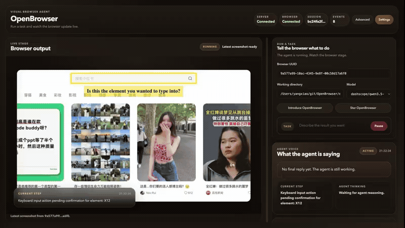

# OpenBrowser

[](https://deepwiki.com/softpudding/OpenBrowser)

[English README](README.md)

OpenBrowser 是一个面向真实网页任务的多模态浏览器 Agent。

它把浏览器自动化视为一个视觉与交互系统问题，而不只是 DOM 解析问题。浏览器是大多数人每天都会使用的最复杂的软件环境之一。读取 DOM 当然有帮助，但理解 DOM 并不等于真正能把网页操作好。我们相信更长期的方向是多模态控制，或者至少是强混合式控制。

OpenBrowser 围绕这个判断来构建：

- 通过截图和直接浏览器操作，以视觉方式理解和控制页面
- 将浏览器执行路径与控制窗口隔离
- 在 mock 网站和真实工作流上持续评测
- 把模型成本当作一等工程约束

> 注意：OpenBrowser 目前仅通过 Chrome 扩展支持 Chrome 浏览器。开发和评测主要基于 `dashscope/qwen3.5-plus` 和 `dashscope/qwen3.5-flash`。

## Demo

### 小红书租房 Demo

这个 demo 更接近 OpenBrowser 想解决的真实网页任务：它会在小红书上搜索西溪湿地附近的一居室整租房源，浏览多条帖子，基于采光、整洁度、装修状态和空间实用性做视觉判断，并筛出更合适的候选。

任务 prompt：

> 帮我在小红书上找 3 个西溪湿地附近的整租一居室。它们最好靠近地铁，不要太老、太暗、太乱或者过度装修；厨房、卫生间和卧室看起来要干净，并且有不错的自然采光。浏览多条帖子，选出最好的 3 个；给最好的 2 个点赞和收藏，并评论询问价格、最早入住时间、能否短租、以及是否允许养猫；最后总结你为什么选它们。



[完整视频：recording_xiaohongshu.webm](demo/recording_xiaohongshu.webm)

这个 demo 展示了：

- 在真实中文内容平台里搜索、开帖、翻图和比较房源
- 基于图片里的采光、整洁度、布局和装修状态做视觉判断
- 在长流程里穿插点赞、收藏、评论等站内交互
- 最终输出候选 shortlist，而不是停在单步按钮操作

## 为什么是 OpenBrowser

### 浏览器很难

浏览器本身已经是工业界最复杂的软件环境之一：动态布局、异步状态、弹窗、标签页切换、可滚动容器、局部渲染，以及充满噪声的视觉上下文，都会在日常任务里同时出现。

### 最原生的界面是视觉

人类操作浏览器，本来就是靠看页面，再配合鼠标和键盘。当前模型想稳定做到这一点仍然需要大量工程辅助，但最自然的控制闭环仍然是视觉的。这也是 OpenBrowser 把截图和交互原语放在核心位置的原因。

### DOM 有帮助，但 DOM-only 不是终局

像 PinchTab 或 OpenClaw Browser Relay 这样的重 DOM 系统在今天可以工作得很好，而且在某些任务上可能比多模态流水线更快、更准。但理解 DOM 并不等于能稳定操作真实页面。我们的判断是，长期最好的浏览器 Agent 会是多模态的，或者至少是强混合式的。

### 评测是开发的一部分

OpenBrowser 不是靠“感觉不错”来迭代的。仓库里包含带事件跟踪的 mock 网站，放在 [`eval/`](eval/) 下；有意义的改动都会在这套评测上验证。真实世界里失败过的行为，也会反过来变成新的评测用例。

### 成本同样重要

模型能力重要，但价格也同样重要。我们不假设 token 成本会一直便宜下去。OpenBrowser 从一开始就把这个约束纳入设计，包括对更强模型和更便宜模型的分层处理。

## 评测

仓库里当前最重要的评测基线，是最新 check-in 的结果文件：

- [`eval/evaluation_report.json`](eval/evaluation_report.json)

这套测试集本身是一系列位于 [`eval/`](eval/) 下的本地 mock 仿真网站，用来模拟真实浏览器任务，并记录结构化交互事件。

这个快照生成于 `2026-04-21 02:09:48`，基于其中 `35` 个带事件跟踪的浏览器任务，对来自 Qwen3.5 和 Qwen3.6 两代的共 4 个模型做评测。我们现在优先看三件事：

- 正确性：是否通过，以及任务分覆盖情况
- 效率：平均执行时间
- 成本：单任务平均 RMB 成本

当前快照结果：

- 总体：`111/140` 次运行通过，整体通过率 `79.3%`
- `dashscope/qwen3.5-plus`：`30/35` 通过，任务分 `276.2/304.8`，平均耗时 `309.51s`，平均成本 `0.598152 RMB`
- `dashscope/qwen3.6-flash`：`29/35` 通过，任务分 `273.0/304.8`，平均耗时 `252.27s`，平均成本 `0.804474 RMB`
- `dashscope/qwen3.6-plus`：`28/35` 通过，任务分 `262.4/304.8`，平均耗时 `337.59s`，平均成本 `1.605398 RMB`
- `dashscope/qwen3.5-flash`：`24/35` 通过，任务分 `243.1/304.8`，平均耗时 `308.84s`，平均成本 `0.144029 RMB`

| 模型 | 正确性 | 平均耗时 | 平均成本（RMB） | 综合分 |
|------|--------|----------|------------------|--------|
| `dashscope/qwen3.5-plus` | `30/35` 通过，`276.2/304.8` | `309.51s` | `0.598152` | `0.7425` |
| `dashscope/qwen3.6-flash` | `29/35` 通过，`273.0/304.8` | `252.27s` | `0.804474` | `0.7191` |
| `dashscope/qwen3.6-plus` | `28/35` 通过，`262.4/304.8` | `337.59s` | `1.605398` | `0.6040` |
| `dashscope/qwen3.5-flash` | `24/35` 通过，`243.1/304.8` | `308.84s` | `0.144029` | `0.6938` |

新的 35 任务测试集比之前的 12 任务快照显著更难——包含多步预订、带标签弹窗的收件箱整理、会自动隐藏控件的播放器、拖拽看板、以及干扰项很多的电商流程等。`qwen3.5-plus` 在当前测试集上综合表现最强；`qwen3.6-flash` 则是“单位耗时正确率”的最佳点——四个模型里最快，且通过率紧随其后。`qwen3.5-flash` 适合更简单流程、作为成本最低档位仍然有用；`qwen3.6-plus` 仍是最贵的档位，但在这套测试集上并没有在速度或正确性上占优。这个仓库现在的主叙事已经不再是“和 OpenClaw 做 benchmark 对比”，而是“看我们当前栈在 Qwen 两代模型上的正确性、速度和成本结果”。

之前与 OpenClaw 的并排对比现在作为 archived 资料保留：

- [`eval/archived/2026-03-16/browser_agent_evaluation_2026-03-16_openclaw_vs_openbrowser.md`](eval/archived/2026-03-16/browser_agent_evaluation_2026-03-16_openclaw_vs_openbrowser.md)

这些归档结果对理解历史权衡仍然有价值，但已经不是我们现在主要优化的指标来源。

### 自己运行评测

```bash
# 列出可用测试
python eval/evaluate_browser_agent.py --list

# 一次性设置浏览器 capability token
export OPENBROWSER_CHROME_UUID=YOUR_BROWSER_UUID

# 用一个已配置的 LLM alias 跑单个测试
python eval/evaluate_browser_agent.py --test techforum --model-alias default

# 用多个已配置 alias 跑全部测试
python eval/evaluate_browser_agent.py --model-alias plus --model-alias flash

# 或者在单次运行里显式传 browser UUID
python eval/evaluate_browser_agent.py --test techforum --chrome-uuid YOUR_BROWSER_UUID --model-alias default
```

`--model-alias` 必须对应你在 OpenBrowser Web UI 里配置过的 LLM alias，比如 `default`、`plus`、`flash`。

评测框架说明见 [AGENTS.md](AGENTS.md#evaluation-system)。

## 快速开始

### 用你的浏览器体验 OpenBrowser

#### 1. 安装 Python 依赖

```bash
# 使用 uv（推荐）
uv sync

# 或者使用 pip
pip install -e .

# 开发环境（包含 pytest、black、ruff 等开发依赖）
uv sync --group dev
# 或者用 pip
pip install -e ".[dev]"
```

#### 2. 启动服务端

```bash
uv run local-chrome-server serve
```

服务会启动在 `http://127.0.0.1:8765`（HTTP）和 `ws://127.0.0.1:8766`（WebSocket）。

#### 3. 配置 LLM 设置

第一次访问时，网页界面会提示你配置 LLM：

1. 在浏览器中打开 `http://localhost:8765`
2. 你会看到 **Configuration Page**
3. 填写 API 配置：
   - **Model**：默认是 `dashscope/qwen3.5-plus`（也支持更便宜的 `dashscope/qwen3.5-flash`）
   - **Base URL**：默认是 `https://dashscope.aliyuncs.com/compatible-mode/v1`
   - **API Key**：你的 API key（必填）
4. 可以按需配置 **Default Working Directory**（CWD）
5. 点击 **Save**，再点击 **Continue to Main Interface**

> **注意**：
> - 配置会保存在 `~/.openbrowser/llm_config.json`
> - 你可以随时通过状态栏里的 **⚙️ Settings** 按钮修改设置
> - 环境变量（LLM_API_KEY、LLM_MODEL、LLM_BASE_URL）**不再支持**，请使用 Web UI 配置

#### 4. 构建 Chrome 扩展

```bash
cd extension
npm install
npm run build
```

#### 5. 在 Chrome 里安装扩展

1. 打开 Chrome，进入 `chrome://extensions/`
2. 开启 **Developer mode**（右上角开关）
3. 点击 **Load unpacked**
4. 选择 `extension/dist` 目录

安装完成后，OpenBrowser 会打开一个浏览器内部页面，显示当前浏览器实例的 UUID。
这个 UUID 就是控制该浏览器实例的权限 key。

重要：

- 任何拿到这个 UUID 的人，都可以通过 OpenBrowser 操作该浏览器
- 不要随意分享
- 之后点击扩展图标，也可以重新打开 UUID 页面

#### 6. 配置 Chrome 弹窗设置（重要）

Chrome 默认会拦截弹出窗口，这可能导致 OpenBrowser 点击链接时无法打开新标签页。你需要允许弹窗：

**方案 A：对特定网站放行（推荐）**

1. 当弹窗被拦截时，地址栏会显示一个被拦截图标（🚫）
2. 点击图标，选择 “Always allow pop-ups and redirects from [site]”
3. 点击 **Done**

**方案 B：全局允许弹窗**

1. 打开 Chrome 设置：`chrome://settings/content/popups`
2. 在 “Default behavior” 下选择 **Sites can send pop-ups and use redirects**
3. 或者把特定网站加到 “Allowed to send pop-ups” 列表里

> **注意**：如果 OpenBrowser 点击了链接却没有打开新标签页，先检查地址栏是否有弹窗拦截图标。这是新用户最常见的问题之一。

#### 7. 打开 Web 前端

在浏览器中访问：

```text
http://localhost:8765
```

现在你就可以通过 Web 界面和 Agent 交互了。

在发送指令前：

1. 从扩展页面复制浏览器 UUID
2. 粘贴到前端的 `BROWSER UUID` 输入框
3. 开始聊天

权限流转过程如下：

1. Chrome 扩展通过 WebSocket 连接到服务端
2. 服务端为该浏览器保存一条 `uuid -> websocket` 映射
3. 前端会话向用户索要这个 UUID
4. 用户发送消息时，前端会把这个 UUID 一起带上
5. 服务端据此把浏览器命令路由到对应扩展连接

这意味着：只要持有这个 UUID capability token，就拥有控制该浏览器的权限。

---

### 也可以通过 SKILL 使用 OpenBrowser

OpenBrowser 同时提供 `Codex` 和 `OpenClaw` 两套 skill：

- `skill/codex/open-browser`
- `skill/openclaw/open-browser`

它们的目标相近，但工作流上有一点区别：

- `Codex` 版更贴合 Codex 的仓库协作工作流，前台或后台执行都可以。
- `OpenClaw` 版更贴合 OpenClaw 的使用方式，更强调后台执行，并把 OpenBrowser 定位为更适合渲染页面和多步浏览器任务的方案。

安装与你本地 agent 环境对应的那一套即可。

## 为什么当前主要使用 Qwen3.5 系列？

OpenBrowser 目前主要围绕 Qwen3.5 系列开发，因为它在多模态浏览器任务上，给出了一个比较实用的能力/成本平衡点。

在实际使用里：

- `qwen3.5-plus` 主要用于更难的视觉推理和更复杂的多步执行
- `qwen3.5-flash` 更适合追求更快迭代速度和更低成本的场景
- 这个项目把模型选择视为工程权衡，而不是产品本身

进一步了解 Qwen3.5：

- [Qwen3.5: Towards Native Multimodal Agents（官方博客）](https://qwen.ai/blog/qwen3.5)
- [Qwen3.5: Towards Native Multimodal Agents（阿里云）](https://www.alibabacloud.com/blog/qwen3.5-towards-native-multimodal-agents)
- [Alibaba unveils Qwen3.5 as China's chatbot race shifts to AI agents (CNBC)](https://www.cnbc.com/2026/02/17/china-alibaba-qwen3.5-ai-agent.html)
- [Alibaba unveils new Qwen3.5 model for 'agentic AI era' (Reuters)](https://www.reuters.com/technology/alibaba-unveils-qwen3.5-agentic-ai)
- [QwenLM/Qwen3.5 (GitHub)](https://github.com/QwenLM/Qwen3.5)

## 设计原则

### 1. 多模态优先，必要时混合

OpenBrowser 以视觉页面理解和直接交互为核心。像 DOM 这样的结构化信号依然可能有帮助，但不会被假设为完整答案。

### 2. 保持执行路径隔离

浏览器 worker 不应该把全部状态都灌进控制窗口。OpenBrowser 使用独立执行路径，让控制模型不必背负完整的浏览器会话历史。

### 3. 持续评测

仓库里包含 mock 网站、事件跟踪和归档对比结果。目标不是只把 demo 做好一次，而是在回归压力下持续变强。

### 4. 尊重成本约束

浏览器 Agent 只有在实际可运行时才有价值。因此 OpenBrowser 把价格和上下文使用量都视为核心设计约束，而不是事后补充。

## 核心特性

- **视觉 AI 自动化**：通过 AI 驱动的视觉识别来“看见”并操作网页
- **浏览器控制**：基于视觉理解和 JavaScript 执行完成点击、输入、滚动和导航
- **标签页管理**：支持打开、关闭、切换和管理标签页，并保持会话隔离
- **数据提取**：利用 AI 对页面结构的理解抓取和收集网站数据
- **表单填写与提交**：自动填写表单、提交数据，并处理多步工作流
- **会话持久化**：在自动化任务之间保留浏览器会话、Cookie 和登录状态
- **多接口访问**：提供 REST API、WebSocket 和 CLI，方便程序化控制

## 架构

```
┌─────────────────────────────────────────────────────────────┐
│              Qwen3.5 Family (Multimodal LLM)                │
│        Qwen3.5-Plus (primary) / Qwen3.5-Flash (cost-effective)
│         Visual Perception │ Decision Making │ Browser Control │
└─────────────────────────────────────────────────────────────┘
                              │
                              ▼
┌─────────────────────────────────────────────────────────────┐
│              OpenBrowser Agent Server (FastAPI)             │
│         REST API │ WebSocket │ Session Management │ Tool Orchestration
└─────────────────────────────────────────────────────────────┘
                              │
                              ▼
┌─────────────────────────────────────────────────────────────┐
│              Chrome Extension (Chrome DevTools)             │
│         Screenshots │ JavaScript Execution │ Tab Management │
└─────────────────────────────────────────────────────────────┘
```

## 开发

### 构建命令

```bash
# 扩展开发模式构建（watch）
cd extension
npm run dev

# TypeScript 类型检查
npm run typecheck
```

### 项目结构

```text
.
├── server/              # FastAPI 服务端与 agent 逻辑
│   ├── agent/           # Agent 编排
│   ├── api/             # REST 接口
│   ├── core/            # 核心处理逻辑
│   └── websocket/       # WebSocket 服务
├── extension/           # Chrome 扩展（TypeScript）
│   ├── src/
│   │   ├── background/  # 带 CDP 的后台脚本
│   │   ├── commands/    # 浏览器自动化命令
│   │   └── content/     # 提供视觉反馈的内容脚本
│   └── dist/            # 构建后的扩展
└── frontend/            # Web UI
```

## 许可证

LGPL-3.0

## 致谢

本项目构建在 [OpenHands SDK](https://github.com/OpenHands/software-agent-sdk) 之上，它为我们的 agent 架构和工具集成提供了基础。感谢 OpenHands 团队对开源社区的贡献。

特别感谢：

- **OpenHands Team**：提供了优秀的 SDK，支撑了整个 agent 系统
- **Qwen Team (Alibaba)**：提供了强大的 Qwen3.5-Plus 多模态模型
